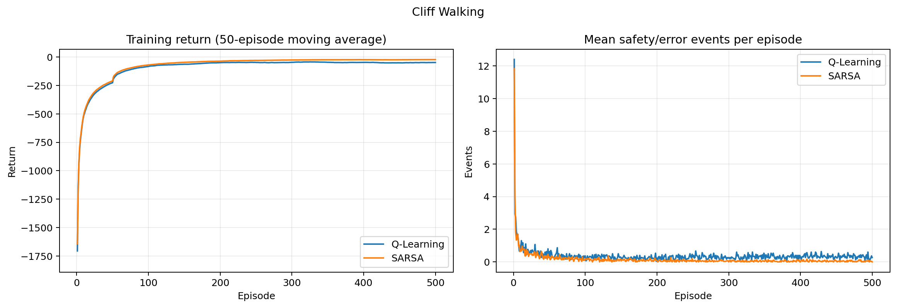
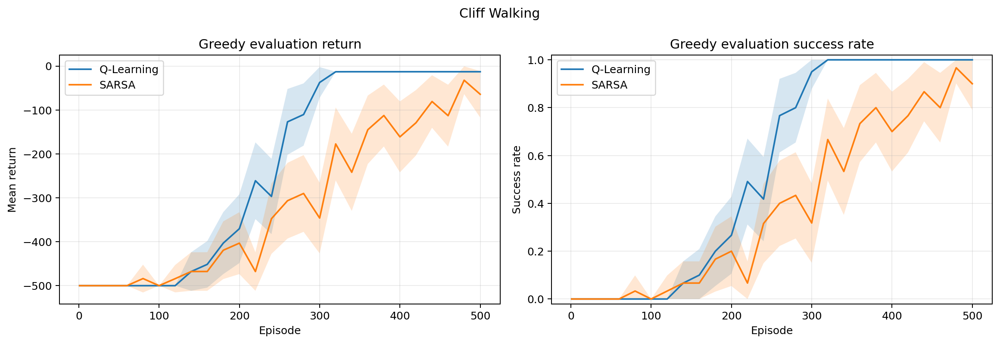
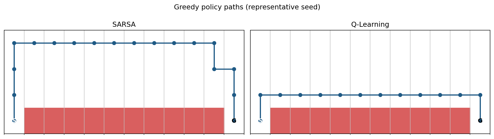

# Thí nghiệm 1: Cliff Walking - SARSA và Q-Learning

## 1. Mục tiêu

Thí nghiệm này đánh giá sự khác biệt giữa SARSA và Q-Learning trên trục an toàn on-policy/off-policy. Câu hỏi nghiên cứu chính là: khi behavior policy vẫn duy trì exploration, hai cách xây dựng TD target ảnh hưởng như thế nào đến đường đi được học, số lần rơi vách và hiệu quả thực tế trong quá trình huấn luyện?

Giả thuyết trước thí nghiệm gồm hai phần:

1. SARSA sẽ có online training return tốt hơn và tỷ lệ rơi vách thấp hơn vì target của nó phản ánh hành động thực sự được lấy mẫu từ behavior policy $\epsilon$-greedy.
2. Q-Learning sẽ học greedy policy ngắn hơn vì target dùng $\max_a Q(S',a)$, không đưa rủi ro của hành động exploration kế tiếp vào bootstrap target.

Hai giả thuyết này không mâu thuẫn. Chúng đo hiệu năng của hai policy khác nhau: behavior policy trong lúc huấn luyện và greedy policy trong lúc evaluation.

## 2. Thiết lập thực nghiệm

Mã thực nghiệm sử dụng `CliffWalking-v1` của Gymnasium với cấu hình sau:

| Thành phần | Giá trị |
|---|---:|
| Thuật toán | SARSA, Q-Learning |
| Số seed | 30 (`0` đến `29`) |
| Episode mỗi seed | 500 |
| Learning rate $\alpha$ | 0.1 |
| Discount factor $\gamma$ | 0.9 |
| Exploration $\epsilon$ | 0.1 cố định |
| Giới hạn mỗi episode | 500 bước |
| Chu kỳ evaluation | 20 episode |
| Số episode mỗi lần evaluation | 30 |
| Evaluation policy | Greedy, không cập nhật Q-table |

Q-table được huấn luyện độc lập trên từng seed. Hai thuật toán dùng cùng tập seed, cùng ngân sách episode, cùng siêu tham số và cùng quy tắc $\epsilon$-greedy. Một sự kiện an toàn được ghi nhận khi reward của transition nhỏ hơn hoặc bằng $-100$, tương ứng với việc rơi xuống vách.

Dữ liệu nguồn gồm:

- `cliff_walking_episodes.csv`: kết quả từng training episode.
- `cliff_walking_evaluations.csv`: kết quả greedy evaluation định kỳ.
- `cliff_walking_config.json`: cấu hình thực nghiệm.

## 3. Kết quả huấn luyện online

### 3.1. Kết quả trên toàn bộ 500 episode

Các thống kê dưới đây được tính theo từng seed trước, sau đó tổng hợp trên 30 seed. Khoảng tin cậy 95% dùng xấp xỉ chuẩn cho trung bình qua seed.

| Thuật toán | Training return trung bình | 95% CI | Lần rơi vách/episode | 95% CI | Tỷ lệ hoàn thành episode |
|---|---:|---:|---:|---:|---:|
| SARSA | -51.70 | [-52.09, -51.30] | 0.161 | [0.158, 0.165] | 99.75% |
| Q-Learning | -71.45 | [-72.60, -70.30] | 0.374 | [0.363, 0.385] | 99.75% |

SARSA tốt hơn Q-Learning khoảng `19.76` return/episode trên toàn bộ quá trình. Với so sánh ghép cặp theo seed, khoảng tin cậy 95% của chênh lệch `SARSA - Q-Learning` là `[18.63, 20.89]`.

Tổng số lần rơi vách ghi nhận trong 15.000 training episode của mỗi thuật toán là:

| Thuật toán | Tổng lần rơi vách | Trung bình trên 100 episode |
|---|---:|---:|
| SARSA | 2.417 | 16.11 |
| Q-Learning | 5.614 | 37.43 |

Như vậy, xét trên toàn bộ training budget, Q-Learning rơi vách nhiều hơn khoảng 2,32 lần. Chênh lệch ghép cặp về số lần rơi vách mỗi episode là `-0.213` theo hướng có lợi cho SARSA, với 95% CI `[-0.224, -0.202]`.

### 3.2. Kết quả trong 100 episode cuối

Giai đoạn cuối phản ánh rõ hơn behavior đã học được sau khi ảnh hưởng của khởi tạo ban đầu giảm xuống.

| Thuật toán | Return trung bình | SD giữa seed của mean return | Rơi vách/episode | SD giữa seed | Training completion rate |
|---|---:|---:|---:|---:|---:|
| SARSA | -23.76 | 2.57 | 0.049 | 0.023 | 100% |
| Q-Learning | -50.06 | 6.29 | 0.332 | 0.059 | 100% |

Trong 100 episode cuối:

- SARSA tốt hơn trung bình `26.30` return/episode; 95% CI ghép cặp là `[24.07, 28.53]`.
- SARSA rơi vách ít hơn `0.284` lần/episode; 95% CI ghép cặp là `[-0.305, -0.262]`.
- Tỷ lệ rơi vách của Q-Learning cao gấp khoảng 6,8 lần SARSA.
- Cả hai thuật toán đều hoàn thành 100% trong 3.000 training episode thuộc cửa sổ cuối (100 episode/seed x 30 seed). Đây là kết quả của **behavior policy** $\epsilon$-greedy trong lúc tiếp tục học, không phải success rate của greedy evaluation tại episode 500.

Con số này không mâu thuẫn với success rate `90%` của SARSA ở Bảng 4.1. Hai phép đo khác nhau về policy và thời điểm lấy mẫu:

- `100%`: tỷ lệ training episode hoàn thành trong toàn bộ cửa sổ episode 401-500, sử dụng behavior policy với $\epsilon=0.1$ và Q-table tiếp tục được cập nhật sau từng transition.
- `90%`: kết quả greedy evaluation chỉ tại checkpoint cuối sau episode 500, không exploration và không cập nhật Q-table. Tại checkpoint này, 27/30 seed thành công; ba seed `18`, `24`, `26` bị giới hạn ở 500 bước.

Vì Q-table vẫn thay đổi trong cửa sổ 100 episode cuối, một seed có thể hoàn thành các training episode trước đó nhưng greedy policy được chụp tại đúng checkpoint cuối lại rơi vào vòng lặp. Do đó, training completion rate không nên được dùng thay cho final greedy success rate.

Đường moving average cho thấy cả hai thuật toán cải thiện nhanh ở giai đoạn đầu. Sau khoảng 100-200 episode, SARSA duy trì return cao hơn. Đồ thị sự kiện an toàn cũng cho thấy số lần rơi vách của SARSA giảm gần về 0, trong khi Q-Learning duy trì một mức rơi vách dương cho đến cuối do $\epsilon=0.1$ không giảm.

## 4. Kết quả greedy evaluation

Evaluation được chạy không exploration và không cập nhật Q-table. Vì vậy, phần này đo chất lượng greedy policy, không đo hành vi thực sự của agent trong lúc huấn luyện.

### 4.1. Kết quả tại episode 500

| Thuật toán | Eval return, mean ± SD | Median | Success rate, mean ± SD | Độ dài episode, mean ± SD |
|---|---:|---:|---:|---:|
| Q-Learning | -13.0 ± 0.0 | -13 | 1.00 ± 0.00 | 13.0 ± 0.0 |
| SARSA | -64.3 ± 147.72 | -16 | 0.90 ± 0.31 | 64.3 ± 147.72 |

Q-Learning đạt cùng một kết quả trên toàn bộ 30 seed:

- Eval return bằng `-13`.
- Success rate bằng `1.0`.
- Độ dài đường đi bằng 13 bước.

Do mọi seed đều cho đúng cùng một giá trị, độ lệch chuẩn của Q-Learning bằng 0. Đây là kết quả hợp lệ trong môi trường deterministic: toàn bộ run đã học được greedy policy tối ưu có cùng độ dài.

Tuy nhiên, `SD = 0` không có nghĩa Q-Learning không biến động hoặc an toàn tuyệt đối trong lúc huấn luyện. Trong 100 training episode cuối, return ở cấp episode của Q-Learning vẫn có SD khoảng `71.80`, đồng thời agent vẫn rơi vách trung bình `0.332` lần/episode. Độ lệch chuẩn bằng 0 chỉ mô tả greedy evaluation cuối cùng sau khi exploration bị tắt.

Với SARSA, 27/30 seed hoàn thành evaluation cuối và 3 seed (`18`, `24`, `26`) không đến được goal trong giới hạn 500 bước. Ba run này đều có eval return `-500`, làm mean giảm mạnh xuống `-64.3` và SD tăng lên `147.72`. Median bằng `-16` phản ánh tốt hơn run SARSA điển hình: phần lớn seed đã học được đường đi thành công nhưng dài hơn đường tối ưu của Q-Learning.

### 4.2. Diễn biến theo episode

| Episode | Q-Learning return | Q-Learning success | SARSA return | SARSA success |
|---:|---:|---:|---:|---:|
| 100 | -500.00 | 0.0% | -500.00 | 0.0% |
| 200 | -370.34 | 26.7% | -403.20 | 20.0% |
| 300 | -37.45 | 95.0% | -346.05 | 31.8% |
| 400 | -13.00 | 100.0% | -161.26 | 70.0% |
| 500 | -13.00 | 100.0% | -64.30 | 90.0% |

Q-Learning cải thiện greedy policy nhanh hơn rõ rệt. Mọi seed Q-Learning đạt eval return ít nhất `-20` lần đầu sau trung bình 204,7 episode, tương ứng khoảng 11.793 environment steps. SARSA đạt mốc này sau trung bình 225,3 episode, tương ứng khoảng 12.312 bước. Đây là thời điểm đạt mốc lần đầu, chưa áp dụng điều kiện phải duy trì mốc trong các lần evaluation tiếp theo.

Khoảng bất định của SARSA rộng và đường cong có dao động vì một số seed tạm thời học được policy thành công rồi thay đổi sau các update tiếp theo. Đây là hệ quả có thể xảy ra khi dùng learning rate và epsilon cố định trong ngân sách hữu hạn; kết quả không nên được gọi là hội tụ tiệm cận theo điều kiện Robbins-Monro.

## 5. Phân tích đường đi

Hình đường đi sử dụng seed 0 làm ví dụ đại diện:

- Q-Learning đi lên một hàng rồi di chuyển ngang ngay phía trên vách, sau đó đi xuống goal. Đây là đường ngắn nhất với 13 bước.
- SARSA đi lên xa hơn, di chuyển dọc hàng trên cùng rồi mới đi xuống goal. Đường này dài hơn nhưng tạo khoảng cách lớn hơn với vùng vách.

Sự khác biệt phù hợp với TD target của hai thuật toán. Q-Learning cập nhật theo continuation greedy:

$$
Y_t^{Q}=R_{t+1}+\gamma\max_a Q(S_{t+1},a).
$$

Target này không tính trực tiếp khả năng behavior policy chọn một hành động exploration nguy hiểm ở bước sau. Vì thế đường sát vách vẫn có giá trị cao nếu xét theo greedy target.

SARSA cập nhật theo action thực sự được behavior policy lấy mẫu:

$$
Y_t^{\text{SARSA}}=R_{t+1}+\gamma Q(S_{t+1},A_{t+1}).
$$

Khi $\epsilon=0.1$ được giữ cố định, hậu quả của action exploration được đưa vào các update. Đường sát vách vì vậy có giá trị kỳ vọng thấp hơn, thúc đẩy agent học đường vòng an toàn.

Hình này chỉ minh họa một seed và không tự nó chứng minh xu hướng trên toàn bộ 30 seed. Bằng chứng định lượng chính vẫn là training return và tỷ lệ rơi vách tổng hợp qua seed.

## 6. Thảo luận

### 6.1. Giả thuyết được ủng hộ

Kết quả ủng hộ cả hai phần của giả thuyết ban đầu:

1. **An toàn và online performance:** SARSA có return huấn luyện tốt hơn, ít rơi vách hơn và biến động giữa seed thấp hơn trong giai đoạn cuối.
2. **Greedy optimality và tốc độ học:** Q-Learning học greedy policy ngắn nhất nhanh hơn và đến cuối đạt cùng kết quả tối ưu trên toàn bộ seed.

Do đó, không có cơ sở để kết luận chung rằng một thuật toán vượt trội tuyệt đối. Kết luận phụ thuộc policy được đánh giá:

- Nếu agent phải tiếp tục hoạt động với exploration, SARSA phù hợp hơn trong cấu hình này vì behavior an toàn hơn.
- Nếu chỉ quan tâm greedy policy sau huấn luyện và có thể tắt exploration, Q-Learning cho kết quả tốt hơn trong ngân sách 500 episode.

### 6.2. Policy mismatch của Q-Learning

Khoảng cách lớn giữa online training return và greedy evaluation của Q-Learning là biểu hiện trực tiếp của policy mismatch. Thuật toán học giá trị cho target policy greedy nhưng dữ liệu được tạo bởi behavior policy $\epsilon$-greedy. Greedy policy cuối đạt `-13`, nhưng behavior policy vẫn thỉnh thoảng chọn action ngẫu nhiên sát vách và chịu penalty `-100`.

Điều này không có nghĩa Q-Learning học sai. Nó học đúng mục tiêu off-policy của mình; chi phí phát sinh vì policy dùng để tương tác trong training khác policy được tối ưu trong target.

### 6.3. Ý nghĩa của các run SARSA thất bại

Ba seed SARSA thất bại ở evaluation cuối cho thấy 500 episode chưa đủ để bảo đảm mọi run có greedy policy thành công dưới cấu hình $\alpha=0.1$, $\epsilon=0.1$ cố định. Đồng thời, vì evaluation curve của SARSA còn dao động, một checkpoint cuối đơn lẻ có thể nhạy với trạng thái Q-table tại đúng episode 500.

Khi báo cáo nên trình bày đồng thời mean, SD, median và tỷ lệ seed thành công. Chỉ báo mean `-64.3` có thể tạo cảm giác rằng run SARSA điển hình rất kém, trong khi median `-16` cho thấy đa số run đã tìm được một đường an toàn và tương đối ngắn.

## 7. Giới hạn của kết quả

1. Kết quả chỉ áp dụng cho `CliffWalking-v1`, tabular Q-table và bộ siêu tham số hiện tại.
2. $\epsilon=0.1$ và $\alpha=0.1$ đều cố định, nên thí nghiệm đánh giá hiệu năng trong ngân sách hữu hạn, không chứng minh hội tụ tiệm cận.
3. Các đồ thị chính đang dùng episode làm trục ngang. Do SARSA và Q-Learning có độ dài episode khác nhau, phân tích sample efficiency nghiêm ngặt nên bổ sung learning curve theo cumulative environment steps.
4. Mốc eval return `-20` được phân tích theo lần đạt đầu tiên, chưa kiểm tra điều kiện duy trì qua nhiều checkpoint.
5. Policy path chỉ lấy seed 0. Nên bổ sung phân bố độ dài greedy path và khoảng cách tới vách trên toàn bộ seed nếu muốn định lượng cấu trúc policy.
6. Môi trường deterministic làm 30 evaluation episode của một Q-table cung cấp ít thông tin bổ sung khi greedy action không có tie. Bất định quan trọng hơn nằm giữa các training seed.
7. Chưa có sensitivity analysis cho epsilon decay và các giá trị learning rate khác trong tập kết quả này.

## 8. Kết luận

Thí nghiệm Cliff Walking cho thấy rõ sự đánh đổi giữa an toàn trong quá trình học và chất lượng greedy policy cuối cùng. SARSA phản ánh rủi ro exploration trong target nên học behavior an toàn hơn: trong 100 episode cuối, return của SARSA cao hơn Q-Learning khoảng `26.30` điểm và tỷ lệ rơi vách thấp hơn gần 6,8 lần. Ngược lại, Q-Learning học đường greedy tối ưu nhanh hơn và kết thúc với return `-13.0 ± 0.0`, success rate `1.0 ± 0.0` trên toàn bộ 30 seed.

Kết quả vì vậy xác nhận cơ chế on-policy/off-policy dự kiến. SARSA tối ưu hiệu quả của policy đang thực thi có exploration, còn Q-Learning tối ưu một greedy target policy tách khỏi behavior policy. Việc lựa chọn thuật toán phải dựa trên việc chi phí sai lầm trong lúc huấn luyện có quan trọng hay không, thay vì chỉ so sánh một metric cuối cùng.
